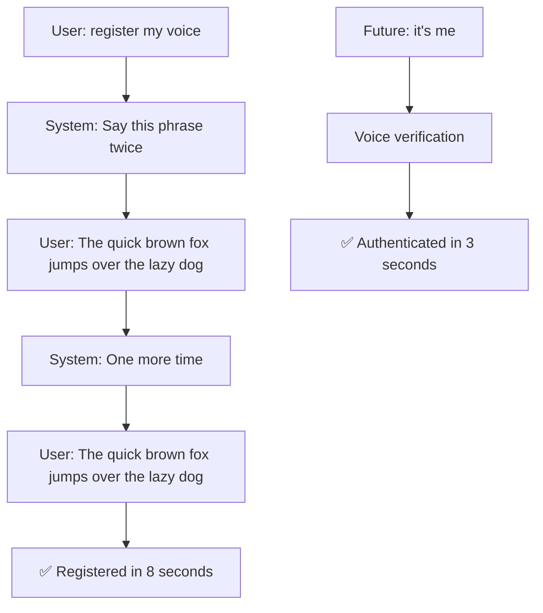

# FastRTC Voice Authentication Onboarding Review

## Executive Summary

FastRTC will implement a **voice-only authentication system** using Resemblyzer for instant user onboarding. Target: **< 10 second signup**, **< 5 second authentication**.

## Current Issues

**Root Cause**: STT audio capture fails during voice registration, causing empty transcription results:

```
🗣️  [STT DEBUG] Transcription result: TranscriptionResult(text='', language='en', confidence=1, chunks=None)
🗣️  [STT DEBUG] Current text (stripped): '' (length: 0)
```

**Good News**: Resemblyzer voice authentication works perfectly - all tests pass.

## New Voice-Only Flow



### Target Performance
- **Signup**: < 10 seconds (2 samples of standard phrase)
- **Authentication**: < 3 seconds (single "it's me" phrase)
- **Accuracy**: > 95% with 85% similarity threshold

### Why Standard Phrases Matter
Resemblyzer needs **sufficient speech content** to extract meaningful voice embeddings:
- **Minimum**: 5-30 seconds of speech for reliable voice profiles
- **Quality**: Longer phrases provide better voice characteristics
- **Consistency**: Same phrase for enrollment ensures reliable comparison

## Implementation Plan

### Week 1: Fix STT Audio Capture
**Critical Fix**: Audio buffer not captured during voice enrollment

```python
# Fix in streaming_callback_handler.py:161
if self.voice_assistant.voice_print_manager.enrollment_mode:
    if audio_array is not None and len(audio_array) > 0:
        self.voice_assistant.voice_print_manager.set_audio_buffer(audio_array)
```

### Week 2: Simplify Registration Patterns
**Update** `backend/src/audio/user_identification.py`:

```python
'voice_register': [
    r"register my voice",
    r"enroll my voice"
],
'voice_auth': [
    r"it'?s me",
    r"this is me"
]
```

**New Flow**:
```python
def start_voice_only_registration(self, user_text: str) -> Dict:
    return {
        'action': 'voice_enrollment_start',
        'message': 'Say this phrase: "The quick brown fox jumps over the lazy dog"',
        'samples_needed': 2,  # Reduced from 3 for speed
        'phrase': 'The quick brown fox jumps over the lazy dog'
    }
```

**Key Insight**: Resemblyzer needs substantial speech content (not just names) to create reliable 256-dimensional voice embeddings. Short words like "John" don't provide enough voice characteristics.

### Week 3: Remove PIN System
- Delete PIN-based authentication code
- Direct voice enrollment as only registration method
- Streamline user identification to voice-only

## Technical Specs

- **Model**: Resemblyzer VoiceEncoder (working ✅)
- **Embedding**: 256-dimensional voice vectors
- **Enrollment**: 2 samples of standard phrase (< 10 seconds total)
- **Authentication**: Single "it's me" phrase (< 3 seconds)
- **Threshold**: 85% similarity for security
- **Performance**: ~1000x real-time on GPU, robust to noise

## Success Metrics

- **Signup**: < 10 seconds total
- **Authentication**: < 3 seconds
- **Accuracy**: > 95% success rate
- **No fallbacks**: Voice-only, no PINs

## Next Steps

1. **Week 1**: Fix STT audio capture bug
2. **Week 2**: Implement simplified voice patterns  
3. **Week 3**: Remove PIN system entirely

**Result**: Magical voice authentication - users say a standard phrase twice to register (8 seconds), then just "it's me" to authenticate instantly (3 seconds).

### Resemblyzer Requirements
Based on the official documentation, Resemblyzer:
- Creates **256-dimensional voice embeddings** from speech
- Needs **sufficient speech content** (5-30 seconds) for reliable voice profiles  
- Works best with **consistent phrases** during enrollment
- Achieves **high accuracy** with proper speech samples
- Runs **1000x real-time** on GPU, robust to noise