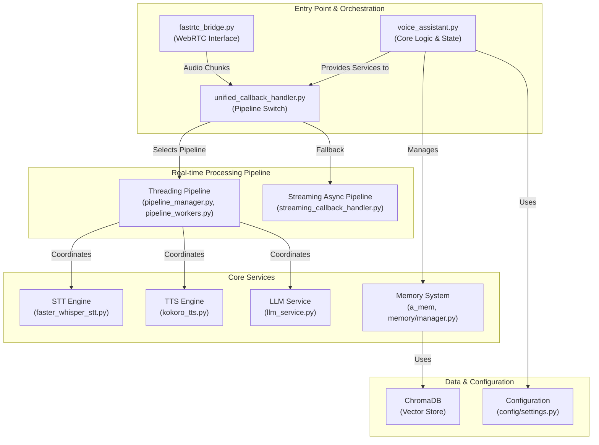
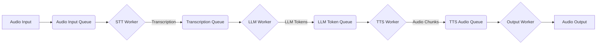

Of course. I will analyze the current codebase and update the `architecture.md` file to accurately reflect the system's design. The most significant changes are the introduction of a non-blocking startup process, a sophisticated threading-based pipeline for real-time processing, and a unified deployment script.

Here is the updated content for `backend/docs/architecture.md`:

# FastRTC Voice Assistant Architecture

## Overview

The FastRTC Voice Assistant is a high-performance, modular system designed for real-time, multilingual voice conversations. The architecture prioritizes low latency, testability, and extensibility by separating core concerns into distinct, swappable components. Key architectural patterns include dependency injection, a hybrid processing pipeline (threading and async), and a unified deployment model.

## High-Level Component Diagram

This diagram shows the main components and their interactions within the backend service.



## Processing Pipeline Architecture

A key feature of the architecture is the `UnifiedCallbackHandler`, which dynamically selects the processing pipeline.

### Threading Pipeline (Default)

This is the primary, high-performance pipeline. It uses a pure threading model with queues to eliminate async/sync bridging complexity and reduce latency.

-   **`AudioPipelineManager`**: A central coordinator that manages worker threads, queues, and state for each voice interaction.
-   **Worker Threads**: Each stage of the STT-LLM-TTS process runs in a dedicated thread.
    -   `STTStreamingWorker`: Transcribes audio.
    -   `LLMStreamingWorker`: Generates text response from the LLM.
    -   `TTSStreamingWorker`: Synthesizes audio from the text response.
    -   `TTSOutputWorker`: Delivers audio back to the user.
-   **Queues**: Data flows sequentially between workers through thread-safe queues, enabling parallel processing of different stages for multiple interactions.



### Streaming Async Pipeline (Fallback)

This pipeline uses an `asyncio`-based approach and serves as a fallback. It processes the entire STT-LLM-TTS chain within a single async-generator function, which is simpler but less parallelizable than the threading model.

## Core Components

-   **`start_deferred.py` (Application Entry Point)**: A non-blocking FastAPI server. It starts instantly and initializes the heavy ML models (STT, TTS) in a background task, ensuring the server is responsive immediately.

-   **`VoiceAssistant` (`src/core/voice_assistant.py`)**: The central orchestrator. It doesn't handle real-time audio directly but manages state (like current language), initializes all service components (STT, TTS, LLM, Memory), and provides them to the callback handlers.

-   **`UnifiedCallbackHandler` (`src/integration/unified_callback_handler.py`)**: The brain of the real-time processing. It receives raw audio from the WebRTC bridge and directs it to the appropriate pipeline (threading or async) based on the application's configuration.

-   **STT Engine (`src/audio/engines/stt/`)**: A modular speech-to-text engine. The default implementation, `FasterWhisperSTT`, uses the highly optimized faster-whisper library for fast and accurate transcription.

-   **TTS Engine (`src/audio/engines/tts/`)**: The text-to-speech engine. The default, `KokoroTTSEngine`, provides efficient, multi-language voice synthesis.

-   **Memory System (`src/memory/` & `src/a_mem/`)**:
    -   **`AMemMemoryManager`**: Manages the agentic memory system (A-MEM), handling conversation history, context retrieval, and memory evolution.
    -   **`ChromaRetriever`**: Uses a persistent **ChromaDB** vector store for efficient semantic search of memories.
    -   **`OllamaEmbeddingFunction`**: Generates embeddings for the memory system by calling a local Ollama service, offloading the embedding model from the main application.

-   **LLM Service (`src/services/llm_service.py`)**: An abstraction layer for communicating with Large Language Models. It supports both **Ollama** and **LM Studio** backends.

## Deployment Architecture

The project uses a universal script, `fastrtc.sh`, to manage different deployment environments, ensuring consistency from local development to production.

-   **Development Mode (`./fastrtc.sh dev`)**: Runs the backend (Python) and frontend (Node.js) as separate local processes. Ideal for rapid feature development.
    ```
    ┌─────────────────┐      ┌─────────────────┐
    │ Frontend (3001) │ ←──→ │ Backend (8000)  │
    └─────────────────┘      └─────────────────┘
           ↑ ↓                      ↑ ↓
    ┌─────────────────┐      ┌─────────────────┐
    │   User Browser  │      │ Ollama/LM Studio│
    └─────────────────┘      └─────────────────┘
    ```

-   **Docker Mode (`./fastrtc.sh docker` or `prod`)**: Containerizes all services using `docker-compose.yml`. This mode is for integration testing and production deployment. It includes a `CoTURN` service to handle WebRTC networking (STUN/TURN) for NAT traversal.
    ```
    ┌─────────────────┐      ┌─────────────────┐      ┌─────────────────┐
    │ Frontend        │      │ Backend         │      │ CoTURN          │
    │ (Next.js)       │      │ (FastAPI)       │      │ (STUN/TURN)     │
    │ Port: 3001      │      │ Port: 8000      │      │ Port: 3478      │
    └─────────────────┘      └─────────────────┘      └─────────────────┘
             │                      │                      │
             └─────────────┬────────┴───────────────┘
                           │
                    ┌─────────────────┐
                    │  Docker Network │
                    └─────────────────┘
    ```

## Data Flow for a Single Turn (Threading Pipeline)

1.  **Audio Input**: The user speaks. The frontend captures audio and sends it via WebRTC to the backend.
2.  **FastRTC Bridge**: Receives the audio stream.
3.  **UnifiedCallbackHandler**: Detects user speech and initiates a new "generation" (a single conversational turn). It hands the audio chunk to the `AudioPipelineManager`.
4.  **Audio Input Queue**: The audio chunk is placed in the `audio_input_queue`.
5.  **STT Worker**:
    *   Picks up the audio chunk.
    *   Transcribes it to text using the `FasterWhisperSTT` engine.
    *   Places the resulting `TranscriptionChunk` into the `transcription_queue`.
6.  **LLM Worker**:
    *   Picks up the transcription.
    *   Streams a response from the configured LLM service (e.g., Ollama).
    *   As tokens arrive, it identifies complete sentences.
    *   Places each complete sentence as an `LLMTokenChunk` into the `llm_token_queue`.
7.  **TTS Worker**:
    *   Picks up a sentence chunk.
    *   Streams synthesized audio from the `KokoroTTSEngine`.
    *   Places the resulting `TTSAudioChunk` into the `tts_audio_queue`.
8.  **Output Worker**:
    *   Picks up the synthesized audio chunk.
    *   Yields it back through the callback chain to the `FastRTCBridge`.
9.  **Audio Output**: The bridge sends the audio back to the user's browser via WebRTC, where it is played.