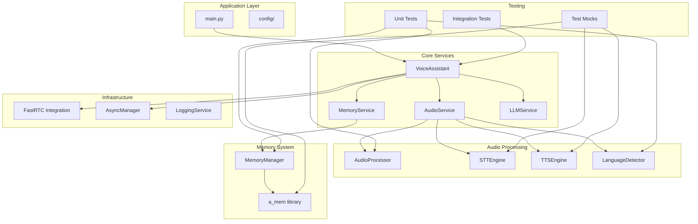

# 🏗️ FastRTC Voice Assistant Refactoring Plan

## 📋 Current State Analysis

### Issues Identified:
1. **Monolithic Structure**: 1457-line single file with mixed responsibilities
2. **Tight Coupling**: Components are heavily interdependent
3. **Hard to Test**: No clear interfaces, global state, mixed sync/async patterns
4. **Configuration Scattered**: Settings spread throughout the code
5. **Poor Error Handling**: Inconsistent error management
6. **Mixed Concerns**: Audio processing, memory, LLM, TTS all intertwined

## 🎯 Refactoring Goals

### 1. **Testability**
- Unit testable components with clear interfaces
- Dependency injection for external services
- Mock-friendly abstractions
- Isolated async/sync boundaries

### 2. **Maintainability**
- Single Responsibility Principle
- Clear module boundaries
- Consistent error handling
- Comprehensive logging

### 3. **Extensibility**
- Plugin architecture for TTS/STT engines
- Configurable memory backends
- Modern language detection with MediaPipe
- Audio processing pipelines

## 🏗️ Proposed Architecture



## 📁 New Project Structure

```
fastrtc_voice_assistant/
├── src/
│   ├── __init__.py
│   ├── main.py                          # Application entry point
│   ├── config/
│   │   ├── __init__.py
│   │   ├── settings.py                  # Configuration management
│   │   ├── language_config.py           # Language mappings
│   │   └── audio_config.py              # Audio settings
│   ├── core/
│   │   ├── __init__.py
│   │   ├── voice_assistant.py           # Main orchestrator
│   │   ├── interfaces.py                # Abstract base classes
│   │   └── exceptions.py                # Custom exceptions
│   ├── services/
│   │   ├── __init__.py
│   │   ├── audio_service.py             # Audio processing coordination
│   │   ├── memory_service.py            # Memory management coordination
│   │   ├── llm_service.py               # LLM interaction service
│   │   └── async_manager.py             # Async lifecycle management
│   ├── audio/
│   │   ├── __init__.py
│   │   ├── processors/
│   │   │   ├── __init__.py
│   │   │   ├── base.py                  # Base audio processor
│   │   │   ├── bluetooth_processor.py   # Bluetooth-specific processing
│   │   │   └── noise_processor.py       # Noise reduction
│   │   ├── engines/
│   │   │   ├── __init__.py
│   │   │   ├── stt/
│   │   │   │   ├── __init__.py
│   │   │   │   ├── base.py              # STT interface
│   │   │   │   ├── huggingface_stt.py   # HuggingFace implementation
│   │   │   │   └── whisper_stt.py       # Whisper implementation
│   │   │   └── tts/
│   │   │       ├── __init__.py
│   │   │       ├── base.py              # TTS interface
│   │   │       └── kokoro_tts.py        # Kokoro implementation
│   │   └── language/
│   │       ├── __init__.py
│   │       ├── detector.py              # Language detection
│   │       └── voice_mapper.py          # Voice selection logic
│   ├── memory/
│   │   ├── __init__.py
│   │   ├── manager.py                   # Memory manager wrapper
│   │   ├── cache.py                     # Response caching
│   │   └── conversation.py              # Conversation buffer
│   ├── integration/
│   │   ├── __init__.py
│   │   ├── fastrtc_bridge.py            # FastRTC integration
│   │   └── callback_handler.py          # Stream callback logic
│   └── utils/
│       ├── __init__.py
│       ├── logging.py                   # Logging configuration
│       ├── device_utils.py              # Device detection
│       └── async_utils.py               # Async utilities
├── tests/
│   ├── __init__.py
│   ├── conftest.py                      # Pytest configuration
│   ├── unit/
│   │   ├── __init__.py
│   │   ├── test_audio_processors.py
│   │   ├── test_language_detection.py
│   │   ├── test_memory_manager.py
│   │   ├── test_stt_engines.py
│   │   ├── test_tts_engines.py
│   │   └── test_voice_assistant.py
│   ├── integration/
│   │   ├── __init__.py
│   │   ├── test_audio_pipeline.py
│   │   ├── test_memory_integration.py
│   │   └── test_full_conversation.py
│   ├── fixtures/
│   │   ├── __init__.py
│   │   ├── audio_samples.py
│   │   └── mock_responses.py
│   └── mocks/
│       ├── __init__.py
│       ├── mock_stt.py
│       ├── mock_tts.py
│       ├── mock_llm.py
│       └── mock_memory.py
├── docs/
│   ├── architecture.md
│   ├── testing_guide.md
│   └── configuration.md
├── requirements.txt
├── requirements-dev.txt                 # Development dependencies
├── pytest.ini                          # Pytest configuration
├── pyproject.toml                       # Project metadata
└── README.md
```

## 🔧 Key Refactoring Components

### 1. **Configuration Management**
```python
# config/settings.py
from dataclasses import dataclass
from typing import Dict, List, Optional

@dataclass
class AudioConfig:
    sample_rate: int = 16000
    chunk_duration: float = 2.0
    noise_threshold: float = 0.15
    minimal_silent_frame_duration_ms: int = 20

@dataclass
class MemoryConfig:
    llm_model: str = "llama3.2:3b"
    embedder_model: str = "nomic-embed-text"
    evolution_threshold: int = 50
    cache_ttl_seconds: int = 180

@dataclass
class LLMConfig:
    use_ollama: bool = True
    ollama_url: str = "http://localhost:11434"
    ollama_model: str = "llama3:8b-instruct-q4_K_M"
    lm_studio_url: str = "http://192.168.1.5:1234/v1"
    lm_studio_model: str = "mistral-nemo-instruct-2407"

@dataclass
class TTSConfig:
    preferred_voice: str = "af_heart"
    fallback_voices: List[str] = None
    speed: float = 1.05

@dataclass
class AppConfig:
    audio: AudioConfig
    memory: MemoryConfig
    llm: LLMConfig
    tts: TTSConfig
    
    def __post_init__(self):
        if self.tts.fallback_voices is None:
            self.tts.fallback_voices = ["af_alloy", "af_bella"]
```

### 2. **Abstract Interfaces**
```python
# core/interfaces.py
from abc import ABC, abstractmethod
from typing import Dict, List, Optional, Tuple, Any
import numpy as np
from dataclasses import dataclass

@dataclass
class TranscriptionResult:
    text: str
    language: Optional[str] = None
    confidence: Optional[float] = None
    chunks: Optional[List[Dict]] = None

@dataclass
class AudioData:
    samples: np.ndarray
    sample_rate: int
    duration: float

class STTEngine(ABC):
    @abstractmethod
    async def transcribe(self, audio: AudioData) -> TranscriptionResult:
        """Transcribe audio to text with language detection."""
        pass

class TTSEngine(ABC):
    @abstractmethod
    async def synthesize(self, text: str, voice: str, language: str) -> AudioData:
        """Synthesize text to speech."""
        pass
    
    @abstractmethod
    def get_available_voices(self, language: str) -> List[str]:
        """Get available voices for a language."""
        pass

class AudioProcessor(ABC):
    @abstractmethod
    def process(self, audio: AudioData) -> AudioData:
        """Process audio data (noise reduction, normalization, etc.)."""
        pass

class LanguageDetector(ABC):
    @abstractmethod
    def detect_language(self, text: str) -> Tuple[str, float]:
        """Detect language from text.
        
        Returns:
            Tuple[str, float]: (language_code, confidence_score)
        """
        pass

class MemoryManager(ABC):
    @abstractmethod
    async def add_memory(self, user_text: str, assistant_text: str) -> Optional[str]:
        """Add a conversation turn to memory."""
        pass
    
    @abstractmethod
    async def search_memories(self, query: str) -> str:
        """Search memories for relevant information."""
        pass
    
    @abstractmethod
    def get_user_context(self) -> str:
        """Get current user context from memory."""
        pass

class LLMService(ABC):
    @abstractmethod
    async def get_response(self, user_text: str, context: str) -> str:
        """Get LLM response to user input."""
        pass
```

### 3. **Dependency Injection**
```python
# core/voice_assistant.py
from typing import Optional
from .interfaces import STTEngine, TTSEngine, AudioProcessor, MemoryManager, LLMService
from ..config.settings import AppConfig

class VoiceAssistant:
    def __init__(
        self,
        stt_engine: STTEngine,
        tts_engine: TTSEngine,
        audio_processor: AudioProcessor,
        memory_manager: MemoryManager,
        llm_service: LLMService,
        config: AppConfig
    ):
        self.stt_engine = stt_engine
        self.tts_engine = tts_engine
        self.audio_processor = audio_processor
        self.memory_manager = memory_manager
        self.llm_service = llm_service
        self.config = config
        
        # Internal state
        self.current_language = "a"  # Default to American English
        self.conversation_buffer = []
        self.turn_count = 0
    
    async def process_audio_turn(self, audio_data: AudioData) -> AudioData:
        """Process a complete audio turn: STT -> LLM -> TTS."""
        # Process audio
        processed_audio = self.audio_processor.process(audio_data)
        
        # Transcribe
        transcription = await self.stt_engine.transcribe(processed_audio)
        
        # Update language if detected
        if transcription.language:
            self.current_language = transcription.language
        
        # Get LLM response
        context = self.memory_manager.get_user_context()
        response_text = await self.llm_service.get_response(transcription.text, context)
        
        # Store in memory
        await self.memory_manager.add_memory(transcription.text, response_text)
        
        # Synthesize response
        voice = self._select_voice_for_language(self.current_language)
        response_audio = await self.tts_engine.synthesize(
            response_text, voice, self.current_language
        )
        
        return response_audio
    
    def _select_voice_for_language(self, language: str) -> str:
        """Select appropriate voice for the current language."""
        available_voices = self.tts_engine.get_available_voices(language)
        return available_voices[0] if available_voices else self.config.tts.preferred_voice
```

### 4. **MediaPipe Language Detection Implementation**
```python
# src/audio/language/detector.py
from typing import Tuple, Optional
import os
from pathlib import Path
from mediapipe.tasks import python
from mediapipe.tasks.python import text
from ..interfaces import LanguageDetector

class MediaPipeLanguageDetector(LanguageDetector):
    """Modern language detection using Google's MediaPipe."""
    
    def __init__(self, model_path: Optional[str] = None):
        """Initialize MediaPipe language detector.
        
        Args:
            model_path: Path to the language detector model. If None, downloads default model.
        """
        self.model_path = model_path or self._ensure_model_downloaded()
        self._detector = None
        self._initialize_detector()
        
        # Language code mapping from MediaPipe to Kokoro TTS
        self.mediapipe_to_kokoro = {
            'en': 'a',    # English -> American English
            'it': 'i',    # Italian
            'es': 'e',    # Spanish
            'fr': 'f',    # French
            'de': 'a',    # German -> fallback to English (not natively supported)
            'pt': 'p',    # Portuguese -> Brazilian Portuguese
            'ja': 'j',    # Japanese
            'ko': 'a',    # Korean -> fallback to English
            'zh': 'z',    # Chinese -> Mandarin Chinese
            'hi': 'h',    # Hindi
            'ru': 'a',    # Russian -> fallback to English
            'ar': 'a',    # Arabic -> fallback to English
        }
    
    def _ensure_model_downloaded(self) -> str:
        """Download MediaPipe language detection model if not present."""
        model_dir = Path("models/mediapipe")
        model_dir.mkdir(parents=True, exist_ok=True)
        model_path = model_dir / "language_detector.tflite"
        
        if not model_path.exists():
            import requests
            print("Downloading MediaPipe language detection model...")
            url = "https://storage.googleapis.com/mediapipe-models/language_detector/language_detector/float32/latest/language_detector.tflite"
            
            response = requests.get(url)
            response.raise_for_status()
            
            with open(model_path, 'wb') as f:
                f.write(response.content)
            print(f"Model downloaded to {model_path}")
        
        return str(model_path)
    
    def _initialize_detector(self):
        """Initialize the MediaPipe language detector."""
        try:
            base_options = python.BaseOptions(model_asset_path=self.model_path)
            options = text.LanguageDetectorOptions(base_options=base_options)
            self._detector = text.LanguageDetector.create_from_options(options)
        except Exception as e:
            raise RuntimeError(f"Failed to initialize MediaPipe language detector: {e}")
    
    def detect_language(self, text: str) -> Tuple[str, float]:
        """Detect language from text using MediaPipe.
        
        Args:
            text: Input text to analyze
            
        Returns:
            Tuple[str, float]: (kokoro_language_code, confidence_score)
        """
        if not text or not text.strip():
            return 'a', 0.0  # Default to American English
        
        try:
            # Get detection results from MediaPipe
            detection_result = self._detector.detect(text.strip())
            
            if not detection_result.detections:
                return 'a', 0.0  # Default to American English
            
            # Get the most confident detection
            best_detection = max(detection_result.detections, key=lambda d: d.probability)
            
            # Map MediaPipe language code to Kokoro language code
            mediapipe_lang = best_detection.language_code
            kokoro_lang = self.mediapipe_to_kokoro.get(mediapipe_lang, 'a')
            confidence = best_detection.probability
            
            return kokoro_lang, confidence
            
        except Exception as e:
            print(f"Language detection error: {e}")
            return 'a', 0.0  # Fallback to American English

# Legacy keyword-based detector for fallback/comparison
class KeywordLanguageDetector(LanguageDetector):
    """Fallback keyword-based language detection (legacy approach)."""
    
    def __init__(self):
        # Expanded language keyword sets from original implementation
        self.language_keywords = {
            'i': [  # Italian
                'ciao', 'grazie', 'prego', 'bene', 'come stai', 'buongiorno', 'buonasera',
                'molto', 'sono', 'dove', 'voglio', 'che', 'parli', 'italiano', 'parlare',
                'posso', 'puoi', 'sì', 'no', 'questo', 'quello', 'quando', 'perché',
                'come', 'cosa', 'chi', 'quale', 'anche', 'ancora', 'dopo', 'prima'
            ],
            'e': [  # Spanish
                'hola', 'gracias', 'por favor', 'bueno', 'como estas', 'buenos dias',
                'muy', 'soy', 'donde', 'quiero', 'que', 'hablar', 'español', 'puedo',
                'puedes', 'sí', 'no', 'este', 'ese', 'cuando', 'porque', 'como'
            ],
            'f': [  # French
                'bonjour', 'merci', 'comment allez', 'tres bien', 'bonsoir', 'je suis',
                'tres', 'ou', 'veux', 'que', 'parler', 'français', 'peux', 'pouvez',
                'oui', 'non', 'ce', 'cette', 'quand', 'pourquoi', 'comment'
            ],
            'p': [  # Portuguese
                'ola', 'obrigado', 'obrigada', 'por favor', 'bom dia', 'como vai',
                'muito', 'sou', 'onde', 'quero', 'que', 'falar', 'português', 'posso',
                'pode', 'sim', 'não', 'este', 'esse', 'quando', 'porque'
            ]
        }
    
    def detect_language(self, text: str) -> Tuple[str, float]:
        """Detect language using keyword matching."""
        if not text:
            return 'a', 0.0
        
        text_lower = text.lower()
        language_scores = {}
        
        for lang_code, keywords in self.language_keywords.items():
            matches = sum(1 for keyword in keywords if keyword in text_lower)
            if matches > 0:
                # Simple confidence based on keyword density
                confidence = min(matches / len(text.split()) * 2, 1.0)
                language_scores[lang_code] = confidence
        
        if language_scores:
            best_lang = max(language_scores.items(), key=lambda x: x[1])
            return best_lang[0], best_lang[1]
        
        return 'a', 0.0  # Default to American English

# Hybrid detector that combines both approaches
class HybridLanguageDetector(LanguageDetector):
    """Hybrid language detector using MediaPipe with keyword fallback."""
    
    def __init__(self):
        try:
            self.primary_detector = MediaPipeLanguageDetector()
            self.use_mediapipe = True
        except Exception as e:
            print(f"MediaPipe detector failed to initialize: {e}")
            self.use_mediapipe = False
        
        self.fallback_detector = KeywordLanguageDetector()
    
    def detect_language(self, text: str) -> Tuple[str, float]:
        """Detect language using MediaPipe, fallback to keywords if needed."""
        if self.use_mediapipe:
            try:
                lang, confidence = self.primary_detector.detect_language(text)
                
                # If MediaPipe confidence is low, try keyword detection
                if confidence < 0.5:
                    keyword_lang, keyword_conf = self.fallback_detector.detect_language(text)
                    if keyword_conf > confidence:
                        return keyword_lang, keyword_conf
                
                return lang, confidence
            except Exception as e:
                print(f"MediaPipe detection failed: {e}")
                # Fall back to keyword detection
                return self.fallback_detector.detect_language(text)
        else:
            return self.fallback_detector.detect_language(text)
```

### 5. **Testing Framework**
**Recommendation: pytest + pytest-asyncio + pytest-mock**

**Why pytest?**
- Excellent fixture system for dependency injection
- Parametrized testing for multiple scenarios
- Rich plugin ecosystem (asyncio, mock, coverage)
- Better error reporting and debugging
- Supports both unit and integration testing

```python
# tests/conftest.py
import pytest
import numpy as np
from unittest.mock import Mock, AsyncMock
from src.core.interfaces import AudioData, TranscriptionResult
from src.config.settings import AppConfig, AudioConfig, MemoryConfig, LLMConfig, TTSConfig

@pytest.fixture
def app_config():
    return AppConfig(
        audio=AudioConfig(),
        memory=MemoryConfig(),
        llm=LLMConfig(),
        tts=TTSConfig()
    )

@pytest.fixture
def sample_audio():
    return AudioData(
        samples=np.random.random(16000).astype(np.float32),
        sample_rate=16000,
        duration=1.0
    )

@pytest.fixture
def mock_stt_engine():
    mock = AsyncMock()
    mock.transcribe.return_value = TranscriptionResult(
        text="Hello, how are you?",
        language="en",
        confidence=0.95
    )
    return mock

@pytest.fixture
def mock_tts_engine():
    mock = AsyncMock()
    mock.synthesize.return_value = AudioData(
        samples=np.random.random(16000).astype(np.float32),
        sample_rate=16000,
        duration=1.0
    )
    mock.get_available_voices.return_value = ["af_heart", "af_bella"]
    return mock

@pytest.fixture
def mock_memory_manager():
    mock = AsyncMock()
    mock.get_user_context.return_value = "User's name is John. Likes coffee."
    mock.add_memory.return_value = "memory_id_123"
    mock.search_memories.return_value = "Found relevant memories..."
    return mock
```

## 📝 Implementation Phases

### **Phase 1: Core Infrastructure** (Week 1)
**Deliverables:**
- [ ] New project structure setup
- [ ] Configuration management system (`config/`)
- [ ] Abstract interfaces (`core/interfaces.py`)
- [ ] Custom exceptions (`core/exceptions.py`)
- [ ] Basic logging setup (`utils/logging.py`)
- [ ] Testing framework with pytest
- [ ] Development dependencies (`requirements-dev.txt`)

**Key Files to Create:**
- `src/config/settings.py` - Configuration dataclasses
- `src/core/interfaces.py` - Abstract base classes
- `src/core/exceptions.py` - Custom exception hierarchy
- `tests/conftest.py` - Pytest fixtures
- `pytest.ini` - Pytest configuration
- `pyproject.toml` - Project metadata

### **Phase 2: Audio Components** (Week 2)
**Deliverables:**
- [ ] Audio processor refactoring (`audio/processors/`)
- [ ] STT engine abstractions (`audio/engines/stt/`)
- [ ] TTS engine abstractions (`audio/engines/tts/`)
- [ ] MediaPipe language detection module (`audio/language/`)
- [ ] Comprehensive unit tests for audio components

**Key Files to Create:**
- `src/audio/processors/bluetooth_processor.py` - Refactored BluetoothAudioProcessor
- `src/audio/engines/stt/huggingface_stt.py` - HuggingFace STT implementation
- `src/audio/engines/tts/kokoro_tts.py` - Kokoro TTS implementation
- `src/audio/language/detector.py` - MediaPipe language detection logic
- `tests/unit/test_audio_processors.py` - Audio processing tests
- `tests/unit/test_language_detection.py` - Language detection tests

### **Phase 3: Memory & LLM Services** (Week 3)
**Deliverables:**
- [ ] Memory service wrapper (`memory/manager.py`)
- [ ] Response caching system (`memory/cache.py`)
- [ ] LLM service abstraction (`services/llm_service.py`)
- [ ] Conversation management (`memory/conversation.py`)
- [ ] Memory and LLM service tests

**Key Files to Create:**
- `src/memory/manager.py` - A-MEM wrapper with clean interface
- `src/memory/cache.py` - Response caching logic
- `src/services/llm_service.py` - LLM interaction service
- `src/memory/conversation.py` - Conversation buffer management
- `tests/unit/test_memory_manager.py` - Memory tests
- `tests/mocks/mock_llm.py` - LLM mocking utilities

### **Phase 4: Integration & FastRTC** (Week 4)
**Deliverables:**
- [ ] FastRTC integration bridge (`integration/fastrtc_bridge.py`)
- [ ] Stream callback handler (`integration/callback_handler.py`)
- [ ] Main voice assistant orchestrator (`core/voice_assistant.py`)
- [ ] Async lifecycle management (`services/async_manager.py`)
- [ ] Integration tests

**Key Files to Create:**
- `src/integration/fastrtc_bridge.py` - FastRTC stream integration
- `src/integration/callback_handler.py` - Refactored callback logic
- `src/core/voice_assistant.py` - Main orchestrator class
- `src/services/async_manager.py` - Async lifecycle management
- `tests/integration/test_audio_pipeline.py` - End-to-end audio tests
- `tests/integration/test_full_conversation.py` - Complete conversation tests

### **Phase 5: Testing & Documentation** (Week 5)
**Deliverables:**
- [ ] Complete test coverage (>90%)
- [ ] Integration tests with real audio samples
- [ ] Performance benchmarking
- [ ] Comprehensive documentation
- [ ] Migration guide from legacy code

**Key Files to Create:**
- `tests/fixtures/audio_samples.py` - Real audio test data
- `tests/integration/test_performance.py` - Performance benchmarks
- `docs/architecture.md` - Architecture documentation
- `docs/testing_guide.md` - Testing guidelines
- `docs/migration_guide.md` - Legacy migration guide

## 🧪 Testing Strategy

### **Unit Tests**
**Audio Processing:**
```python
# tests/unit/test_audio_processors.py
def test_bluetooth_processor_noise_reduction(sample_audio):
    processor = BluetoothAudioProcessor()
    processed = processor.process(sample_audio)
    assert processed.samples.shape == sample_audio.samples.shape
    assert np.max(np.abs(processed.samples)) <= 1.0

def test_bluetooth_processor_dc_removal():
    # Test DC offset removal
    audio_with_dc = AudioData(
        samples=np.ones(1000) * 0.5,  # DC offset
        sample_rate=16000,
        duration=1.0
    )
    processor = BluetoothAudioProcessor()
    processed = processor.process(audio_with_dc)
    assert abs(np.mean(processed.samples)) < 0.01
```

**Language Detection:**
```python
# tests/unit/test_language_detection.py
@pytest.mark.parametrize("text,expected_lang,min_confidence", [
    ("Hello, how are you?", "en", 0.8),
    ("Ciao, come stai?", "it", 0.8),
    ("Hola, ¿cómo estás?", "es", 0.8),
    ("Bonjour, comment allez-vous?", "fr", 0.8),
    ("Guten Tag, wie geht es Ihnen?", "de", 0.8),
    ("分久必合合久必分", "zh", 0.8),
])
def test_mediapipe_language_detection(text, expected_lang, min_confidence):
    detector = MediaPipeLanguageDetector()
    detected_lang, confidence = detector.detect_language(text)
    assert detected_lang == expected_lang
    assert confidence >= min_confidence

def test_language_detection_fallback():
    detector = MediaPipeLanguageDetector()
    # Test with very short or unclear text
    detected_lang, confidence = detector.detect_language("Hi")
    assert isinstance(detected_lang, str)
    assert 0.0 <= confidence <= 1.0
```

**Memory Management:**
```python
# tests/unit/test_memory_manager.py
@pytest.mark.asyncio
async def test_memory_storage_and_retrieval():
    manager = MemoryManager(user_id="test_user")
    
    # Store memory
    memory_id = await manager.add_memory("My name is John", "Nice to meet you, John!")
    assert memory_id is not None
    
    # Retrieve context
    context = manager.get_user_context()
    assert "John" in context
```

### **Integration Tests**
**Audio Pipeline:**
```python
# tests/integration/test_audio_pipeline.py
@pytest.mark.asyncio
async def test_complete_audio_pipeline(voice_assistant, sample_audio):
    response_audio = await voice_assistant.process_audio_turn(sample_audio)
    assert isinstance(response_audio, AudioData)
    assert response_audio.samples.size > 0
    assert response_audio.sample_rate == 16000
```

**Memory Integration:**
```python
# tests/integration/test_memory_integration.py
@pytest.mark.asyncio
async def test_memory_persistence_across_sessions():
    # Test that memories persist between sessions
    manager1 = MemoryManager(user_id="test_user")
    await manager1.add_memory("I like coffee", "Good to know!")
    
    # Simulate new session
    manager2 = MemoryManager(user_id="test_user")
    context = manager2.get_user_context()
    assert "coffee" in context.lower()
```

### **Performance Tests**
```python
# tests/integration/test_performance.py
@pytest.mark.asyncio
async def test_response_latency(voice_assistant, sample_audio):
    import time
    start_time = time.time()
    
    response = await voice_assistant.process_audio_turn(sample_audio)
    
    end_time = time.time()
    latency = end_time - start_time
    
    # Should respond within 4 seconds
    assert latency < 4.0
```

### **Test Data & Mocks**
**Audio Samples:**
```python
# tests/fixtures/audio_samples.py
import numpy as np
from src.core.interfaces import AudioData

def create_test_audio(duration: float = 1.0, frequency: float = 440.0) -> AudioData:
    """Create test audio with a sine wave."""
    sample_rate = 16000
    samples = int(sample_rate * duration)
    t = np.linspace(0, duration, samples)
    audio = np.sin(2 * np.pi * frequency * t).astype(np.float32)
    
    return AudioData(
        samples=audio,
        sample_rate=sample_rate,
        duration=duration
    )

def create_multilingual_samples() -> Dict[str, AudioData]:
    """Create test samples for different languages."""
    # In practice, these would be real audio files
    return {
        "english": create_test_audio(duration=2.0, frequency=440),
        "italian": create_test_audio(duration=2.0, frequency=523),
        "spanish": create_test_audio(duration=2.0, frequency=659),
    }
```

**Mock Services:**
```python
# tests/mocks/mock_stt.py
from src.core.interfaces import STTEngine, TranscriptionResult, AudioData

class MockSTTEngine(STTEngine):
    def __init__(self, responses: Dict[str, str] = None):
        self.responses = responses or {
            "default": "Hello, this is a test transcription."
        }
    
    async def transcribe(self, audio: AudioData) -> TranscriptionResult:
        # Simple mock: return based on audio duration
        if audio.duration < 1.0:
            text = "Short audio"
        elif audio.duration < 3.0:
            text = self.responses.get("default", "Medium audio")
        else:
            text = "Long audio transcription"
        
        return TranscriptionResult(
            text=text,
            language="en",
            confidence=0.95
        )
```

## 🚀 Benefits of This Refactoring

### **Immediate Benefits**
- **Testable Components**: Each module can be tested in isolation
- **Cleaner Code**: Single responsibility, better organization
- **Easier Debugging**: Clear error boundaries and logging
- **Configuration Management**: Centralized, type-safe settings

### **Long-term Benefits**
- **Easy Feature Addition**: Plugin architecture for new engines
- **Performance Optimization**: Isolated components for profiling
- **Team Development**: Clear module boundaries for collaboration
- **Maintenance**: Easier to update individual components

### **Benefits of MediaPipe Language Detection**

**Advantages over Keyword-Based Detection:**
- **Accuracy**: ML-based detection vs. simple keyword matching
- **Coverage**: Supports 100+ languages out of the box
- **Robustness**: Handles mixed languages, short text, and edge cases
- **Confidence Scores**: Provides probability scores for better decision making
- **Maintenance**: No need to maintain keyword lists for each language
- **Performance**: Optimized TensorFlow Lite model for fast inference

**Comparison:**
```python
# Old keyword-based approach (current implementation)
def detect_language_from_text(self, text: str) -> str:
    italian_words = ['ciao', 'grazie', 'bene', ...]  # 50+ words
    spanish_words = ['hola', 'gracias', 'bueno', ...] # 50+ words
    # ... manual keyword lists for each language
    
    # Simple counting approach - prone to false positives
    italian_matches = sum(1 for word in italian_words if word in text_lower)
    # ... requires manual tuning and maintenance

# New MediaPipe approach
def detect_language(self, text: str) -> Tuple[str, float]:
    detection_result = self._detector.detect(text.strip())
    best_detection = max(detection_result.detections, key=lambda d: d.probability)
    return self.mediapipe_to_kokoro[best_detection.language_code], best_detection.probability
```

### **Extensibility Examples**
**New STT Engine:**
```python
# src/audio/engines/stt/openai_stt.py
class OpenAISTTEngine(STTEngine):
    async def transcribe(self, audio: AudioData) -> TranscriptionResult:
        # Implementation for OpenAI Whisper API
        pass
```

**Different Memory Backend:**
```python
# src/memory/backends/redis_memory.py
class RedisMemoryManager(MemoryManager):
    async def add_memory(self, user_text: str, assistant_text: str) -> Optional[str]:
        # Redis-based memory implementation
        pass
```

**Additional Languages with MediaPipe:**
```python
# config/language_config.py - Now much simpler!
MEDIAPIPE_TO_KOKORO_MAPPING = {
    'en': 'a',    # English -> American English
    'it': 'i',    # Italian
    'es': 'e',    # Spanish
    'fr': 'f',    # French
    'de': 'g',    # German (if Kokoro adds support)
    'pt': 'p',    # Portuguese
    'ja': 'j',    # Japanese
    'zh': 'z',    # Chinese
    'hi': 'h',    # Hindi
    'ru': 'r',    # Russian (if Kokoro adds support)
    'ar': 'ar',   # Arabic (if Kokoro adds support)
    # MediaPipe supports 100+ languages - just add mapping!
}
```

**Custom Language Detection Strategy:**
```python
# src/audio/language/custom_detector.py
class CustomLanguageDetector(LanguageDetector):
    def __init__(self):
        self.mediapipe_detector = MediaPipeLanguageDetector()
        self.domain_specific_rules = DomainSpecificRules()
    
    def detect_language(self, text: str) -> Tuple[str, float]:
        # Combine MediaPipe with domain-specific logic
        mp_lang, mp_conf = self.mediapipe_detector.detect_language(text)
        
        # Apply domain-specific adjustments
        if self.domain_specific_rules.is_technical_text(text):
            # Technical text might default to English
            return 'a', max(mp_conf, 0.8)
        
        return mp_lang, mp_conf
```

**Custom Audio Processing:**
```python
# src/audio/processors/noise_gate_processor.py
class NoiseGateProcessor(AudioProcessor):
    def process(self, audio: AudioData) -> AudioData:
        # Implement noise gate logic
        pass
```

## 📊 Migration Strategy

### **Backward Compatibility**
1. **Keep Legacy Code**: Rename current file to `voice_assistant_legacy.py`
2. **Gradual Migration**: Implement new components alongside legacy
3. **Feature Flags**: Use configuration to switch between old/new implementations
4. **Data Preservation**: Ensure existing A-MEM data is preserved

### **Migration Steps**
1. **Phase 1**: Set up new structure, keep legacy running
2. **Phase 2**: Migrate audio components, test in parallel
3. **Phase 3**: Migrate memory/LLM, validate data consistency
4. **Phase 4**: Switch to new FastRTC integration
5. **Phase 5**: Remove legacy code after validation

### **Risk Mitigation**
- **Comprehensive Testing**: Full test suite before each migration step
- **Staged Rollout**: Deploy to test environment first
- **Monitoring**: Add metrics to track performance and errors
- **Rollback Plan**: Keep legacy code available for quick rollback
- **Data Backup**: Backup A-MEM database before migration

### **Validation Criteria**
- [ ] All existing functionality works identically
- [ ] Performance is equal or better than legacy
- [ ] Memory usage is within acceptable bounds
- [ ] All tests pass with >90% coverage
- [ ] No data loss during migration

## 🔧 Development Setup

### **Requirements**
```txt
# requirements.txt (updated)
fastrtc[vad,stt,tts,stopword]
requests
soundfile
chromadb>=0.4.22
sentence-transformers>=2.2.2
rank_bm25>=0.2.2
mem0ai
aiohttp
asyncio
qdrant-client
transformers>=4.36.2
fastrtc-whisper-cpp
mediapipe>=0.10.0  # NEW: For language detection

# requirements-dev.txt
pytest>=7.0.0
pytest-asyncio>=0.21.0
pytest-mock>=3.10.0
pytest-cov>=4.0.0
black>=23.0.0
isort>=5.12.0
mypy>=1.0.0
flake8>=6.0.0
pre-commit>=3.0.0
```

### **Pre-commit Hooks**
```yaml
# .pre-commit-config.yaml
repos:
  - repo: https://github.com/psf/black
    rev: 23.1.0
    hooks:
      - id: black
  - repo: https://github.com/pycqa/isort
    rev: 5.12.0
    hooks:
      - id: isort
  - repo: https://github.com/pycqa/flake8
    rev: 6.0.0
    hooks:
      - id: flake8
  - repo: https://github.com/pre-commit/mirrors-mypy
    rev: v1.0.0
    hooks:
      - id: mypy
```

### **CI/CD Pipeline**
```yaml
# .github/workflows/test.yml
name: Tests
on: [push, pull_request]
jobs:
  test:
    runs-on: ubuntu-latest
    strategy:
      matrix:
        python-version: [3.9, 3.10, 3.11]
    steps:
      - uses: actions/checkout@v3
      - name: Set up Python
        uses: actions/setup-python@v4
        with:
          python-version: ${{ matrix.python-version }}
      - name: Install dependencies
        run: |
          pip install -r requirements-dev.txt
      - name: Run tests
        run: |
          pytest --cov=src --cov-report=xml
      - name: Upload coverage
        uses: codecov/codecov-action@v3
```

## 📈 Success Metrics

### **Code Quality**
- [ ] Test coverage >90%
- [ ] Cyclomatic complexity <10 per function
- [ ] No code duplication >5%
- [ ] All type hints present

### **Performance**
- [ ] Response latency <4 seconds
- [ ] Memory usage <500MB
- [ ] CPU usage <50% during conversation
- [ ] No memory leaks over 24h operation

### **Maintainability**
- [ ] Clear module boundaries
- [ ] Consistent error handling
- [ ] Comprehensive documentation
- [ ] Easy to add new features

This refactoring plan provides a comprehensive roadmap for transforming the monolithic voice assistant into a modular, testable, and extensible system. The phased approach ensures minimal risk while delivering immediate benefits in code quality and maintainability.