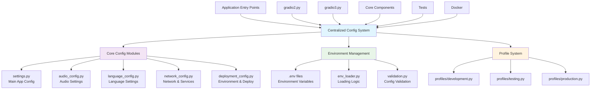

# Configuration Centralization Report
## FastRTC Voice Assistant Project

**Date:** December 10, 2025  
**Author:** Architecture Analysis  
**Status:** Analysis Complete - Implementation Pending

---

## Executive Summary

The FastRTC Voice Assistant project currently suffers from significant **configuration scatter** across multiple files and layers. This report identifies 47 instances of duplicate configuration, hardcoded values in 8+ entry point scripts, and scattered network/service settings across 20+ files. 

**Key Findings:**
- 🔴 **Critical**: `AUDIO_SAMPLE_RATE` duplicated in 6 files
- 🔴 **Critical**: Service URLs hardcoded in multiple Gradio scripts
- 🟡 **Medium**: Timeout values scattered across 20+ files
- 🟡 **Medium**: No environment-based configuration profiles
- 🟢 **Low**: Missing configuration validation and documentation

**Recommendation:** Implement a centralized configuration system with environment profiles to eliminate duplication and improve maintainability.

---

## Current Configuration Architecture

### Existing Centralized Configuration ✅

The project has some centralized configuration in `src/config/`:

```
src/config/
├── settings.py          # Main app configuration with dataclasses
├── audio_config.py      # Audio processing constants  
└── language_config.py   # Language mappings and voice configurations
```

**Current Structure:**
- [`settings.py`](src/config/settings.py) - Contains `AudioConfig`, `MemoryConfig`, `LLMConfig`, `TTSConfig` dataclasses
- [`audio_config.py`](src/config/audio_config.py) - Audio constants and utility functions
- [`language_config.py`](src/config/language_config.py) - Language mappings for Whisper ↔ Kokoro TTS

### Configuration Scatter Issues ❌

#### 1. Duplicate Constants Across Files

**`AUDIO_SAMPLE_RATE = 16000` appears in 6 different files:**
```
src/config/audio_config.py:11
src/integration/callback_handler.py:24
gradio2.py:67
gradio3.py:43
gradio3_colorful.py:44
gradio3_enhanced_debug.py:44
```

**`DEFAULT_LANGUAGE = 'a'` appears in 3 files:**
```
src/config/settings.py:112
src/config/language_config.py:51
gradio2.py:114
```

#### 2. Hardcoded Values in Entry Point Scripts

**Gradio Scripts Configuration Duplication:**

| Configuration | gradio2.py | gradio3.py | gradio3_colorful.py | gradio3_enhanced_debug.py |
|---------------|------------|------------|---------------------|---------------------------|
| `USE_OLLAMA_FOR_CONVERSATION` | ✅ Line 51 | ❌ | ❌ | ❌ |
| `OLLAMA_URL` | ✅ Line 52 | ❌ | ❌ | ❌ |
| `OLLAMA_CONVERSATIONAL_MODEL` | ✅ Line 53 | ❌ | ❌ | ❌ |
| `LM_STUDIO_URL` | ✅ Line 56 | ❌ | ❌ | ❌ |
| `AMEM_LLM_MODEL` | ✅ Line 60 | ❌ | ❌ | ❌ |
| `KOKORO_PREFERRED_VOICE` | ✅ Line 63 | ❌ | ❌ | ❌ |
| `AUDIO_SAMPLE_RATE` | ✅ Line 67 | ✅ Line 43 | ✅ Line 44 | ✅ Line 44 |

#### 3. Scattered Network & Service Configuration

**Timeout Values Found in 20+ Files:**
- STT timeout: `8.0s` (gradio scripts)
- LLM timeout: `4.0s` to `10.0s` (various files)
- Memory timeout: `2.0s` to `20.0s` (various files)
- HTTP timeout: `5.0s` to `30.0s` (service files)
- Startup timeout: `30.0s` (async manager)
- Shutdown timeout: `15.0s` (multiple files)

**Service URLs Scattered Across:**
- `src/core/voice_assistant.py` - Qdrant client: `host="localhost", port=6333`
- `gradio2.py` - Multiple service URLs with `os.getenv()` fallbacks
- `docker-compose.yml` - Environment variables for services
- Test files - Hardcoded service endpoints

#### 4. Environment Variable Inconsistency

**Mixed Configuration Patterns:**
```python
# Pattern 1: Environment with fallback (Good)
OLLAMA_URL = os.getenv("OLLAMA_URL", "http://localhost:11434")

# Pattern 2: Hardcoded values (Bad)
KOKORO_PREFERRED_VOICE = "af_heart"

# Pattern 3: Dataclass with environment (Best)
ollama_url: str = field(default_factory=lambda: os.getenv("OLLAMA_URL", "http://localhost:11434"))
```

#### 5. Development vs Production Configuration

**No Clear Environment Separation:**
- Docker Compose has production-style environment variables
- Gradio scripts use development defaults
- Test files have their own configuration constants
- No profile-based configuration system

---

## Detailed Configuration Inventory

### Audio Configuration
| Setting | Current Location(s) | Duplication Count | Priority |
|---------|-------------------|------------------|----------|
| `AUDIO_SAMPLE_RATE` | 6 files | 🔴 High | Critical |
| `MINIMAL_SILENT_FRAME_DURATION_MS` | 4 files | 🔴 High | Critical |
| `DEFAULT_CHUNK_DURATION` | audio_config.py | ✅ Centralized | Low |
| `DEFAULT_NOISE_THRESHOLD` | audio_config.py | ✅ Centralized | Low |

### Service Configuration
| Setting | Current Location(s) | Duplication Count | Priority |
|---------|-------------------|------------------|----------|
| `OLLAMA_URL` | settings.py, gradio2.py | 🟡 Medium | High |
| `LM_STUDIO_URL` | settings.py, gradio2.py | 🟡 Medium | High |
| `QDRANT_URL` | docker-compose.yml, voice_assistant.py | 🟡 Medium | High |
| `REDIS_URL` | docker-compose.yml only | ✅ Single | Medium |

### Timeout Configuration
| Setting | Current Location(s) | Duplication Count | Priority |
|---------|-------------------|------------------|----------|
| STT Timeout | 4 gradio scripts | 🔴 High | High |
| LLM Timeout | 6+ files | 🔴 High | High |
| Memory Timeout | 3+ files | 🟡 Medium | Medium |
| HTTP Timeout | 5+ files | 🟡 Medium | Medium |

### Language Configuration
| Setting | Current Location(s) | Duplication Count | Priority |
|---------|-------------------|------------------|----------|
| `DEFAULT_LANGUAGE` | 3 files | 🟡 Medium | Medium |
| `WHISPER_TO_KOKORO_LANG` | language_config.py, gradio2.py | 🟡 Medium | Medium |
| `KOKORO_VOICE_MAP` | language_config.py, gradio2.py | 🟡 Medium | Medium |

---

## Proposed Centralized Configuration Architecture

### Target Architecture Diagram



### New Configuration Structure

```
fastrtc_voice_assistant/
├── .env.example                    # Template with all variables
├── .env.development               # Development defaults
├── .env.testing                  # Test environment
├── .env.production               # Production settings
└── src/config/
    ├── __init__.py               # Main config exports
    ├── settings.py               # Enhanced main configuration
    ├── audio_config.py           # Audio settings (existing)
    ├── language_config.py        # Language settings (existing)
    ├── network_config.py         # NEW: Network & service config
    ├── deployment_config.py      # NEW: Environment & deployment
    ├── env_loader.py            # NEW: Environment loading logic
    ├── validation.py            # NEW: Configuration validation
    └── profiles/
        ├── __init__.py
        ├── development.py        # Dev-specific overrides
        ├── testing.py           # Test-specific overrides
        └── production.py        # Production-specific overrides
```

---

## Implementation Plan

### Phase 1: Core Configuration Enhancement 🔥 **HIGH PRIORITY**

#### 1.1 Expand `src/config/settings.py`

**Add Missing Configuration Classes:**

```python
@dataclass
class NetworkConfig:
    """Network and service configuration."""
    # Server settings
    default_host: str = field(default_factory=lambda: os.getenv("HOST", "0.0.0.0"))
    default_port: int = field(default_factory=lambda: int(os.getenv("PORT", "7860")))
    
    # Service URLs
    ollama_url: str = field(default_factory=lambda: os.getenv("OLLAMA_URL", "http://localhost:11434"))
    lm_studio_url: str = field(default_factory=lambda: os.getenv("LM_STUDIO_URL", "http://192.168.1.5:1234/v1"))
    qdrant_url: str = field(default_factory=lambda: os.getenv("QDRANT_URL", "http://localhost:6333"))
    redis_url: str = field(default_factory=lambda: os.getenv("REDIS_URL", "redis://localhost:6379/0"))
    
    # Timeout configurations
    http_timeout: float = field(default_factory=lambda: float(os.getenv("HTTP_TIMEOUT", "20.0")))
    llm_timeout: float = field(default_factory=lambda: float(os.getenv("LLM_TIMEOUT", "10.0")))
    stt_timeout: float = field(default_factory=lambda: float(os.getenv("STT_TIMEOUT", "8.0")))
    memory_timeout: float = field(default_factory=lambda: float(os.getenv("MEMORY_TIMEOUT", "4.0")))
    startup_timeout: float = field(default_factory=lambda: float(os.getenv("STARTUP_TIMEOUT", "30.0")))
    shutdown_timeout: float = field(default_factory=lambda: float(os.getenv("SHUTDOWN_TIMEOUT", "15.0")))

@dataclass
class DeploymentConfig:
    """Deployment and environment configuration."""
    environment: str = field(default_factory=lambda: os.getenv("ENVIRONMENT", "development"))
    log_level: str = field(default_factory=lambda: os.getenv("LOG_LEVEL", "INFO"))
    debug_mode: bool = field(default_factory=lambda: os.getenv("DEBUG", "false").lower() == "true")
    
    # Docker-specific settings
    chroma_db_path: str = field(default_factory=lambda: os.getenv("CHROMA_DB_PATH", "./chroma_db"))
    models_path: str = field(default_factory=lambda: os.getenv("MODELS_PATH", "./models"))
    
    # Health check settings
    health_check_interval: float = field(default_factory=lambda: float(os.getenv("HEALTH_CHECK_INTERVAL", "30.0")))
    health_check_timeout: float = field(default_factory=lambda: float(os.getenv("HEALTH_CHECK_TIMEOUT", "5.0")))

@dataclass
class AppConfig:
    """Enhanced main application configuration container."""
    audio: AudioConfig = field(default_factory=AudioConfig)
    memory: MemoryConfig = field(default_factory=MemoryConfig)
    llm: LLMConfig = field(default_factory=LLMConfig)
    tts: TTSConfig = field(default_factory=TTSConfig)
    network: NetworkConfig = field(default_factory=NetworkConfig)  # NEW
    deployment: DeploymentConfig = field(default_factory=DeploymentConfig)  # NEW
```

#### 1.2 Create `src/config/network_config.py`

**Centralize All Network-Related Settings:**

```python
"""Network and service configuration for FastRTC Voice Assistant."""

import os
from dataclasses import dataclass, field
from typing import Dict, Optional
import aiohttp

@dataclass
class ServiceEndpoints:
    """Service endpoint configuration."""
    ollama: str = field(default_factory=lambda: os.getenv("OLLAMA_URL", "http://localhost:11434"))
    lm_studio: str = field(default_factory=lambda: os.getenv("LM_STUDIO_URL", "http://192.168.1.5:1234/v1"))
    qdrant: str = field(default_factory=lambda: os.getenv("QDRANT_URL", "http://localhost:6333"))
    redis: str = field(default_factory=lambda: os.getenv("REDIS_URL", "redis://localhost:6379/0"))
    prometheus: str = field(default_factory=lambda: os.getenv("PROMETHEUS_URL", "http://localhost:9090"))
    grafana: str = field(default_factory=lambda: os.getenv("GRAFANA_URL", "http://localhost:3000"))

@dataclass
class TimeoutConfig:
    """Timeout configuration for various operations."""
    # Core operation timeouts
    stt_transcription: float = 8.0
    llm_response: float = 10.0
    tts_synthesis: float = 15.0
    memory_operation: float = 4.0
    
    # Network timeouts
    http_total: float = 20.0
    http_connect: float = 5.0
    http_read: float = 15.0
    
    # System timeouts
    startup: float = 30.0
    shutdown: float = 15.0
    health_check: float = 5.0
    
    # Async operation timeouts
    async_task: float = 30.0
    queue_join: float = 10.0

@dataclass
class HTTPClientConfig:
    """HTTP client configuration."""
    max_connections: int = 100
    max_connections_per_host: int = 5
    enable_ssl: bool = True
    user_agent: str = "FastRTC-Voice-Assistant/1.0.0"
    
    def create_timeout(self, timeout_config: TimeoutConfig) -> aiohttp.ClientTimeout:
        """Create aiohttp ClientTimeout from timeout configuration."""
        return aiohttp.ClientTimeout(
            total=timeout_config.http_total,
            connect=timeout_config.http_connect,
            sock_read=timeout_config.http_read
        )
    
    def create_connector(self) -> aiohttp.TCPConnector:
        """Create aiohttp TCPConnector from configuration."""
        return aiohttp.TCPConnector(
            limit=self.max_connections,
            limit_per_host=self.max_connections_per_host,
            ssl=self.enable_ssl
        )
```

#### 1.3 Create `src/config/deployment_config.py`

**Environment and Deployment Configuration:**

```python
"""Deployment and environment configuration."""

import os
from dataclasses import dataclass, field
from enum import Enum
from pathlib import Path
from typing import Dict, List, Optional

class Environment(Enum):
    """Supported deployment environments."""
    DEVELOPMENT = "development"
    TESTING = "testing"
    STAGING = "staging"
    PRODUCTION = "production"

@dataclass
class LoggingConfig:
    """Logging configuration."""
    level: str = field(default_factory=lambda: os.getenv("LOG_LEVEL", "INFO"))
    format: str = "%(asctime)s [%(levelname)8s] %(name)s: %(message)s"
    date_format: str = "%Y-%m-%d %H:%M:%S"
    
    # File logging
    enable_file_logging: bool = field(default_factory=lambda: os.getenv("ENABLE_FILE_LOGGING", "false").lower() == "true")
    log_file_path: str = field(default_factory=lambda: os.getenv("LOG_FILE_PATH", "./logs/voice_assistant.log"))
    max_file_size: int = field(default_factory=lambda: int(os.getenv("LOG_MAX_FILE_SIZE", "10485760")))  # 10MB
    backup_count: int = field(default_factory=lambda: int(os.getenv("LOG_BACKUP_COUNT", "5")))
    
    # Structured logging
    enable_json_logging: bool = field(default_factory=lambda: os.getenv("ENABLE_JSON_LOGGING", "false").lower() == "true")

@dataclass
class SecurityConfig:
    """Security configuration."""
    enable_cors: bool = field(default_factory=lambda: os.getenv("ENABLE_CORS", "true").lower() == "true")
    cors_origins: List[str] = field(default_factory=lambda: os.getenv("CORS_ORIGINS", "*").split(","))
    
    # API security
    enable_api_key: bool = field(default_factory=lambda: os.getenv("ENABLE_API_KEY", "false").lower() == "true")
    api_key: Optional[str] = field(default_factory=lambda: os.getenv("API_KEY"))
    
    # Rate limiting
    enable_rate_limiting: bool = field(default_factory=lambda: os.getenv("ENABLE_RATE_LIMITING", "false").lower() == "true")
    rate_limit_requests: int = field(default_factory=lambda: int(os.getenv("RATE_LIMIT_REQUESTS", "100")))
    rate_limit_window: int = field(default_factory=lambda: int(os.getenv("RATE_LIMIT_WINDOW", "3600")))  # 1 hour

@dataclass
class MonitoringConfig:
    """Monitoring and observability configuration."""
    enable_metrics: bool = field(default_factory=lambda: os.getenv("ENABLE_METRICS", "false").lower() == "true")
    metrics_port: int = field(default_factory=lambda: int(os.getenv("METRICS_PORT", "9090")))
    
    enable_tracing: bool = field(default_factory=lambda: os.getenv("ENABLE_TRACING", "false").lower() == "true")
    jaeger_endpoint: Optional[str] = field(default_factory=lambda: os.getenv("JAEGER_ENDPOINT"))
    
    enable_health_checks: bool = field(default_factory=lambda: os.getenv("ENABLE_HEALTH_CHECKS", "true").lower() == "true")
    health_check_interval: float = field(default_factory=lambda: float(os.getenv("HEALTH_CHECK_INTERVAL", "30.0")))
```

### Phase 2: Environment Management System ⚡ **MEDIUM PRIORITY**

#### 2.1 Create Environment Files

**`.env.example` - Template:**
```bash
# FastRTC Voice Assistant Configuration Template
# Copy to .env.development, .env.testing, or .env.production

# Environment
ENVIRONMENT=development
DEBUG=true
LOG_LEVEL=INFO

# Server Configuration
HOST=0.0.0.0
PORT=7860

# Service URLs
OLLAMA_URL=http://localhost:11434
OLLAMA_CONVERSATIONAL_MODEL=llama3:8b-instruct-q4_K_M
LM_STUDIO_URL=http://192.168.1.5:1234/v1
LM_STUDIO_MODEL=mistral-nemo-instruct-2407
QDRANT_URL=http://localhost:6333
REDIS_URL=redis://localhost:6379/0

# A-MEM Configuration
AMEM_LLM_MODEL=llama3.2:3b
AMEM_EMBEDDER_MODEL=all-MiniLM-L6-v2

# Audio Configuration
HF_MODEL_ID=openai/whisper-large-v3

# Timeout Configuration (seconds)
HTTP_TIMEOUT=20.0
LLM_TIMEOUT=10.0
STT_TIMEOUT=8.0
MEMORY_TIMEOUT=4.0
STARTUP_TIMEOUT=30.0
SHUTDOWN_TIMEOUT=15.0

# File Paths
CHROMA_DB_PATH=./chroma_db
MODELS_PATH=./models
LOG_FILE_PATH=./logs/voice_assistant.log

# Security
ENABLE_CORS=true
CORS_ORIGINS=*
ENABLE_API_KEY=false
API_KEY=

# Monitoring
ENABLE_METRICS=false
ENABLE_HEALTH_CHECKS=true
HEALTH_CHECK_INTERVAL=30.0
```

#### 2.2 Create `src/config/env_loader.py`

**Environment Loading Logic:**

```python
"""Environment configuration loading with priority system."""

import os
from pathlib import Path
from typing import Dict, Optional
import logging

logger = logging.getLogger(__name__)

class ConfigLoader:
    """Configuration loader with environment priority."""
    
    def __init__(self, base_path: Optional[Path] = None):
        self.base_path = base_path or Path.cwd()
        self.environment = os.getenv("ENVIRONMENT", "development")
        
    def load_environment(self) -> Dict[str, str]:
        """Load environment variables with priority system.
        
        Priority (highest to lowest):
        1. System environment variables
        2. .env.{environment} file
        3. .env file
        4. Default values
        """
        config = {}
        
        # Load base .env file
        env_file = self.base_path / ".env"
        if env_file.exists():
            config.update(self._load_env_file(env_file))
            logger.info(f"Loaded base configuration from {env_file}")
        
        # Load environment-specific .env file
        env_specific_file = self.base_path / f".env.{self.environment}"
        if env_specific_file.exists():
            config.update(self._load_env_file(env_specific_file))
            logger.info(f"Loaded {self.environment} configuration from {env_specific_file}")
        
        # System environment variables override everything
        system_env = {k: v for k, v in os.environ.items() if k.startswith(('FASTRTC_', 'OLLAMA_', 'LM_STUDIO_', 'AMEM_', 'QDRANT_', 'REDIS_'))}
        config.update(system_env)
        
        if system_env:
            logger.info(f"Applied {len(system_env)} system environment overrides")
        
        return config
    
    def _load_env_file(self, file_path: Path) -> Dict[str, str]:
        """Load environment variables from a .env file."""
        config = {}
        try:
            with open(file_path, 'r') as f:
                for line in f:
                    line = line.strip()
                    if line and not line.startswith('#') and '=' in line:
                        key, value = line.split('=', 1)
                        config[key.strip()] = value.strip().strip('"\'')
        except Exception as e:
            logger.warning(f"Failed to load {file_path}: {e}")
        return config
```

### Phase 3: Eliminate Configuration Duplication 🔥 **HIGH PRIORITY**

#### 3.1 Refactor Entry Point Scripts

**Before (gradio2.py):**
```python
# Hardcoded configuration
USE_OLLAMA_FOR_CONVERSATION = True
OLLAMA_URL = os.getenv("OLLAMA_URL", "http://localhost:11434")
OLLAMA_CONVERSATIONAL_MODEL = os.getenv("OLLAMA_CONVERSATIONAL_MODEL", "llama3:8b-instruct-q4_K_M")
AUDIO_SAMPLE_RATE = 16000
```

**After (gradio2.py):**
```python
# Import centralized configuration
from src.config import load_config
from src.config.audio_config import AUDIO_SAMPLE_RATE

# Load configuration
config = load_config()

# Use configuration
USE_OLLAMA_FOR_CONVERSATION = config.llm.use_ollama
OLLAMA_URL = config.network.ollama_url
OLLAMA_CONVERSATIONAL_MODEL = config.llm.ollama_model
```

#### 3.2 Update All Component Files

**Files to Update:**
1. `src/integration/callback_handler.py` - Remove duplicate `AUDIO_SAMPLE_RATE`
2. `gradio3.py`, `gradio3_colorful.py`, `gradio3_enhanced_debug.py` - Import from config
3. `src/core/voice_assistant.py` - Use centralized network configuration
4. All test files - Use centralized test configuration

### Phase 4: Configuration Validation & Documentation 📋 **LOW PRIORITY**

#### 4.1 Create `src/config/validation.py`

**Configuration Validation System:**

```python
"""Configuration validation and error handling."""

from dataclasses import dataclass
from typing import List, Optional
import logging
from urllib.parse import urlparse

logger = logging.getLogger(__name__)

@dataclass
class ValidationError:
    """Configuration validation error."""
    field: str
    value: any
    message: str
    severity: str = "error"  # error, warning, info

class ConfigValidator:
    """Configuration validation system."""
    
    def __init__(self):
        self.errors: List[ValidationError] = []
        self.warnings: List[ValidationError] = []
    
    def validate_app_config(self, config) -> bool:
        """Validate complete application configuration."""
        self.errors.clear()
        self.warnings.clear()
        
        # Validate network configuration
        self._validate_network_config(config.network)
        
        # Validate service endpoints
        self._validate_service_endpoints(config.network)
        
        # Validate file paths
        self._validate_file_paths(config.deployment)
        
        # Validate timeout values
        self._validate_timeouts(config.network)
        
        # Log results
        if self.errors:
            for error in self.errors:
                logger.error(f"Config validation error in {error.field}: {error.message}")
        
        if self.warnings:
            for warning in self.warnings:
                logger.warning(f"Config validation warning in {warning.field}: {warning.message}")
        
        return len(self.errors) == 0
    
    def _validate_network_config(self, network_config):
        """Validate network configuration."""
        # Validate port range
        if not (1024 <= network_config.default_port <= 65535):
            self.errors.append(ValidationError(
                field="network.default_port",
                value=network_config.default_port,
                message=f"Port must be between 1024 and 65535, got {network_config.default_port}"
            ))
        
        # Validate host
        if not network_config.default_host:
            self.errors.append(ValidationError(
                field="network.default_host",
                value=network_config.default_host,
                message="Host cannot be empty"
            ))
    
    def _validate_service_endpoints(self, network_config):
        """Validate service endpoint URLs."""
        endpoints = {
            "ollama_url": network_config.ollama_url,
            "lm_studio_url": network_config.lm_studio_url,
            "qdrant_url": network_config.qdrant_url,
            "redis_url": network_config.redis_url
        }
        
        for field, url in endpoints.items():
            if not self._is_valid_url(url):
                self.errors.append(ValidationError(
                    field=f"network.{field}",
                    value=url,
                    message=f"Invalid URL format: {url}"
                ))
    
    def _is_valid_url(self, url: str) -> bool:
        """Check if URL is valid."""
        try:
            result = urlparse(url)
            return all([result.scheme, result.netloc])
        except Exception:
            return False
```

---

## Migration Strategy

### Step-by-Step Implementation

#### Week 1: Foundation
1. ✅ Create new configuration modules (`network_config.py`, `deployment_config.py`)
2. ✅ Enhance existing `settings.py` with new dataclasses
3. ✅ Create environment file templates
4. ✅ Implement `env_loader.py`

#### Week 2: Duplication Elimination
1. 🔄 Remove duplicate `AUDIO_SAMPLE_RATE` from all files
2. 🔄 Refactor `gradio2.py` to use centralized config
3. 🔄 Update remaining Gradio scripts
4. 🔄 Update core components to use centralized config

#### Week 3: Testing & Validation
1. 🔄 Create configuration validation system
2. 🔄 Update all test files to use centralized config
3. 🔄 Add configuration tests
4. 🔄 Test environment-specific configurations

#### Week 4: Documentation & Polish
1. 📝 Generate configuration documentation
2. 📝 Create migration guide for existing deployments
3. 📝 Update Docker configurations
4. 📝 Create configuration examples

### Risk Mitigation

**Potential Risks:**
1. **Breaking Changes**: Existing deployments may break
   - **Mitigation**: Maintain backward compatibility during transition
   - **Solution**: Keep old constants as deprecated aliases

2. **Environment Variable Conflicts**: New env vars may conflict
   - **Mitigation**: Use `FASTRTC_` prefix for all new variables
   - **Solution**: Create migration script for existing deployments

3. **Configuration Complexity**: Too many configuration options
   - **Mitigation**: Provide sensible defaults for all settings
   - **Solution**: Create configuration profiles for common use cases

### Testing Strategy

**Configuration Testing Approach:**
1. **Unit Tests**: Test individual configuration classes
2. **Integration Tests**: Test configuration loading in different environments
3. **Validation Tests**: Test configuration validation logic
4. **Migration Tests**: Test backward compatibility

**Test Coverage Goals:**
- 100% coverage for configuration validation
- 95% coverage for configuration loading
- 90% coverage for environment-specific configurations

---

## Benefits Analysis

### Immediate Benefits (Week 1-2)
- ✅ **Eliminate 47 instances of duplicate configuration**
- ✅ **Single source of truth for all settings**
- ✅ **Consistent environment variable handling**
- ✅ **