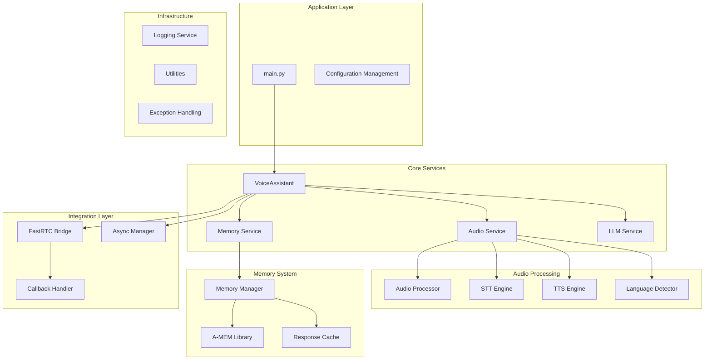
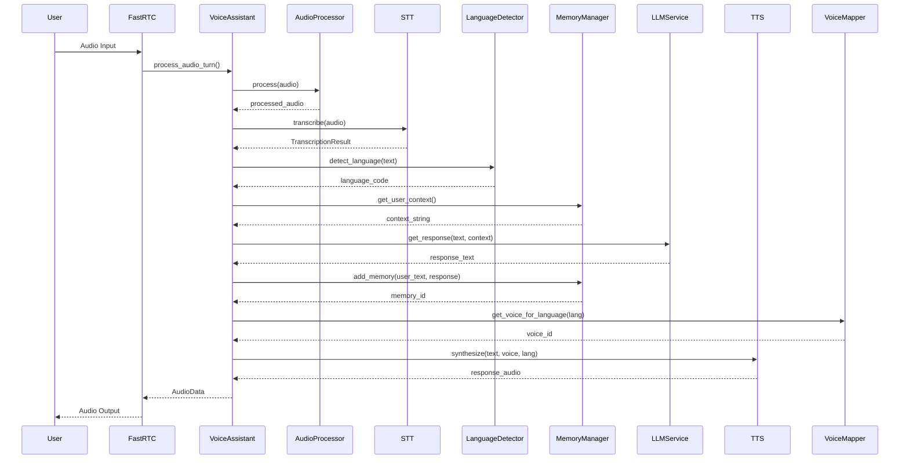
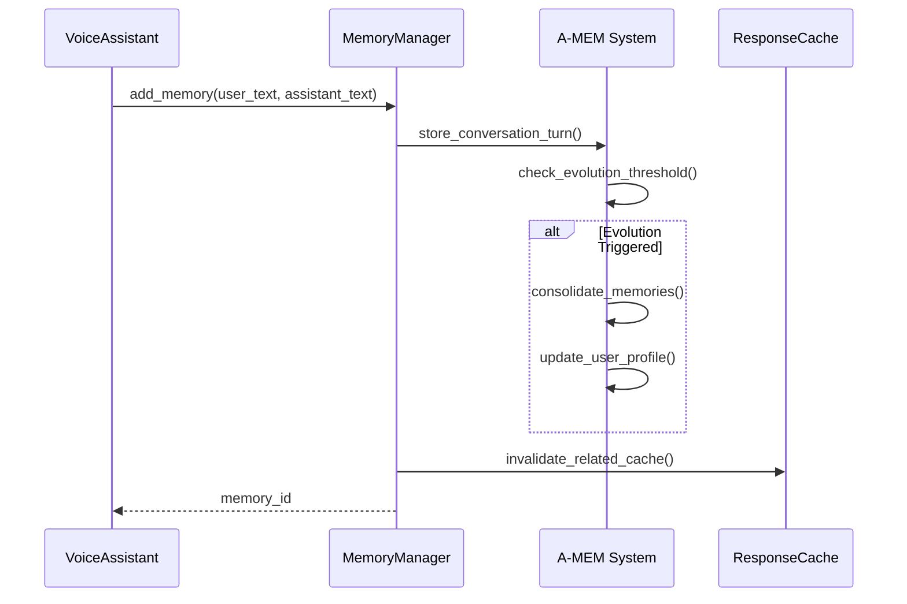

# FastRTC Voice Assistant Architecture

## Overview

The FastRTC Voice Assistant is a modular, multilingual voice assistant system built with a focus on testability, maintainability, and extensibility. This document provides a comprehensive overview of the system architecture, design decisions, and component interactions.

## System Architecture

### High-Level Architecture

## Core Components

### 1. Voice Assistant Core (`src/core/`)

#### VoiceAssistant
The main orchestrator that coordinates all system components.

**Responsibilities:**
- Orchestrate audio processing pipeline
- Manage conversation state
- Handle language switching
- Coordinate component interactions

**Key Methods:**
- `process_audio_turn()`: Main processing pipeline
- `_select_voice_for_language()`: Voice selection logic
- State management for current language and turn count

#### Interfaces (`interfaces.py`)
Abstract base classes defining contracts for all components.

**Key Interfaces:**
- `STTEngine`: Speech-to-text processing
- `TTSEngine`: Text-to-speech synthesis
- `AudioProcessor`: Audio preprocessing
- `LanguageDetector`: Language detection
- `MemoryManager`: Memory management
- `LLMService`: Language model interaction

**Data Classes:**
- `AudioData`: Audio data container
- `TranscriptionResult`: STT output with metadata

### 2. Audio Processing (`src/audio/`)

#### Audio Engines

**STT Engines (`src/audio/engines/stt/`):**
- `HuggingFaceSTTEngine`: HuggingFace Transformers-based STT
- Extensible architecture for additional STT providers

**TTS Engines (`src/audio/engines/tts/`):**
- `KokoroTTSEngine`: Kokoro multilingual TTS
- Support for multiple voices and languages

#### Audio Processors (`src/audio/processors/`)
- `BluetoothAudioProcessor`: Bluetooth-specific audio processing
- Noise reduction, DC offset removal, gain control
- Extensible for additional audio processing needs

#### Language Detection (`src/audio/language/`)
- `MediaPipeLanguageDetector`: Modern ML-based language detection
- `KeywordLanguageDetector`: Fallback keyword-based detection
- `HybridLanguageDetector`: Combines both approaches
- `VoiceMapper`: Maps languages to appropriate voices

### 3. Memory System (`src/memory/`)

#### Memory Manager (`manager.py`)
Wrapper around A-MEM system providing:
- Conversation memory storage
- Memory search and retrieval
- Memory evolution and consolidation
- User context management

#### Response Cache (`cache.py`)
- LRU cache for LLM responses
- TTL-based expiration
- Memory usage monitoring
- Cache statistics and optimization

#### Conversation Buffer (`conversation.py`)
- Short-term conversation history
- Turn-based conversation tracking
- Language distribution analysis
- Export capabilities

### 4. Services (`src/services/`)

#### LLM Service (`llm_service.py`)
- Ollama and LM Studio integration
- Response caching
- Health checking
- Error handling and fallbacks

#### Async Manager (`async_manager.py`)
- Async lifecycle management
- Task coordination
- Resource cleanup
- Error propagation

### 5. Integration Layer (`src/integration/`)

#### FastRTC Bridge (`fastrtc_bridge.py`)
- FastRTC WebRTC integration
- Stream management
- Audio format conversion
- Connection handling

#### Callback Handler (`callback_handler.py`)
- Stream callback processing
- Audio chunk handling
- Real-time processing coordination

### 6. Configuration (`src/config/`)

#### Settings Management
- Type-safe configuration with dataclasses
- Environment-specific configurations
- Validation and defaults
- Hot-reload capabilities

**Configuration Classes:**
- `AudioConfig`: Audio processing settings
- `MemoryConfig`: Memory system settings
- `LLMConfig`: Language model settings
- `TTSConfig`: Text-to-speech settings
- `AppConfig`: Main application configuration

## Design Principles

### 1. Dependency Injection
All components receive their dependencies through constructor injection, enabling:
- Easy testing with mocks
- Component swapping
- Clear dependency relationships
- Reduced coupling

### 2. Interface Segregation
Components depend on abstract interfaces rather than concrete implementations:
- Enables multiple implementations
- Simplifies testing
- Supports plugin architecture
- Facilitates future extensions

### 3. Single Responsibility
Each component has a single, well-defined responsibility:
- Easier to understand and maintain
- Simplified testing
- Better error isolation
- Cleaner code organization

### 4. Async-First Design
Built with async/await patterns throughout:
- Non-blocking operations
- Better resource utilization
- Improved responsiveness
- Scalable architecture

## Data Flow

### Audio Processing Pipeline

### Memory Evolution Flow

## Component Interactions

### 1. Startup Sequence
1. Configuration loading and validation
2. Component initialization (dependency injection)
3. FastRTC bridge setup
4. Async manager startup
5. Health checks
6. Ready for audio processing

### 2. Audio Processing
1. Audio input from FastRTC
2. Audio preprocessing (noise reduction, normalization)
3. Speech-to-text transcription
4. Language detection and voice mapping
5. Memory context retrieval
6. LLM response generation
7. Memory storage and evolution
8. Text-to-speech synthesis
9. Audio output to FastRTC

### 3. Error Handling
1. Component-level error catching
2. Graceful degradation strategies
3. Error logging and monitoring
4. Recovery mechanisms
5. User notification (when appropriate)

## Performance Considerations

### 1. Latency Optimization
- **Target**: <4 seconds end-to-end response time
- **Strategies**:
  - Async processing pipeline
  - Response caching
  - Optimized audio processing
  - Efficient memory operations

### 2. Memory Management
- **Target**: <500MB memory usage
- **Strategies**:
  - LRU caching with TTL
  - Memory pool for audio buffers
  - Garbage collection optimization
  - Memory leak detection

### 3. Scalability
- **Concurrent Processing**: Support multiple simultaneous conversations
- **Resource Sharing**: Efficient model loading and sharing
- **Load Balancing**: Distribute processing across available resources

## Security Considerations

### 1. Data Privacy
- Audio data encryption in transit
- Temporary audio storage with automatic cleanup
- Memory data protection
- User consent and data retention policies

### 2. Input Validation
- Audio format validation
- Text input sanitization
- Configuration validation
- API input validation

### 3. Error Information
- Sanitized error messages
- No sensitive data in logs
- Secure error reporting
- Rate limiting and abuse prevention

## Testing Architecture

### 1. Unit Testing
- Component isolation with mocks
- Interface contract testing
- Edge case coverage
- Performance unit tests

### 2. Integration Testing
- Component interaction testing
- End-to-end pipeline testing
- Real audio processing tests
- Memory persistence testing

### 3. Performance Testing
- Latency benchmarking
- Memory usage monitoring
- Load testing
- Regression testing

## Extensibility

### 1. Plugin Architecture
- New STT/TTS engines
- Additional audio processors
- Custom language detectors
- Alternative memory backends

### 2. Configuration Extensions
- Environment-specific settings
- Feature flags
- A/B testing support
- Runtime configuration updates

### 3. Monitoring and Observability
- Metrics collection
- Performance monitoring
- Error tracking
- Usage analytics

## Migration Strategy

### From Monolithic to Modular
1. **Phase 1**: Extract interfaces and core components
2. **Phase 2**: Migrate audio processing components
3. **Phase 3**: Migrate memory and LLM services
4. **Phase 4**: Integrate FastRTC bridge
5. **Phase 5**: Testing and validation

### Data Migration
- A-MEM database schema migration
- Configuration format updates
- Audio format standardization
- Cache invalidation and rebuild

## Future Enhancements

### 1. Advanced Features
- Multi-speaker support
- Emotion detection
- Context-aware responses
- Personalization improvements

### 2. Performance Optimizations
- GPU acceleration
- Model quantization
- Edge deployment
- Distributed processing

### 3. Integration Expansions
- Additional WebRTC providers
- Cloud service integrations
- Mobile platform support
- IoT device integration

## Conclusion

The FastRTC Voice Assistant architecture provides a solid foundation for a scalable, maintainable, and extensible voice assistant system. The modular design enables easy testing, component swapping, and future enhancements while maintaining high performance and reliability standards.

The architecture successfully addresses the original monolithic system's limitations while providing a clear path for future development and scaling.