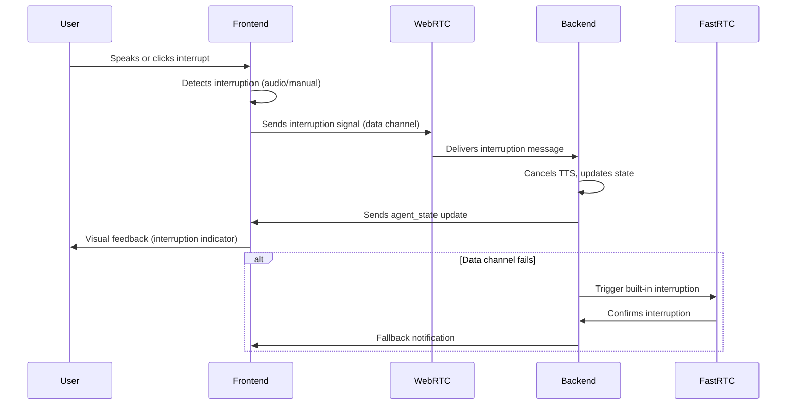

# Task 001: Frontend Event-Driven Interruption System (REWRITE)

> **Reference:** The original version is preserved in [`tasks/001-implement-frontend-event-driven-interruption-system.md`](tasks/001-implement-frontend-event-driven-interruption-system.md:1).

---

## 1. Overview

| Field         | Value           |
|---------------|----------------|
| **Priority**  | HIGH           |
| **Estimate**  | 4-6 hours      |
| **Status**    | READY          |
| **Assignee**  | [Assign before start] |
| **Created**   | 2025-01-26     |

---

## 2. Problem Statement

The current FastRTC interruption system causes conversation crashes due to delayed or failed interruption handling. Static VAD parameters prevent real-time user interruption, resulting in overlapping audio and poor user experience.

---

## 3. Solution Summary

Implement a frontend-driven, event-based interruption system that:
- Detects user interruption in real time (audio spike or manual trigger)
- Sends interruption signal to backend via WebRTC data channel
- Backend cancels agent speech immediately and synchronizes state
- Fallbacks to FastRTC interruption if frontend fails

---

## 4. Responsibilities

| Component | Responsibilities |
|-----------|------------------|
| **Frontend**  | Detect interruption, send signal, provide UI feedback, allow manual override |
| **Backend**   | Receive signal, cancel TTS, sync state, handle fallback, log events |

---

## 5. Implementation Steps

### 5.1 Frontend

- [ ] Create `interruption-handler.ts` (core logic, see [API Spec](#api-spec))
- [ ] Integrate handler in `background-circle-provider.tsx` (state, UI feedback)
- [ ] Update `webrtc-client.ts` to handle interruption and state sync messages
- [ ] Add manual interrupt button and status indicator

### 5.2 Backend

- [ ] Create `interruption_manager.py` (signal handling, TTS cancellation)
- [ ] Integrate with `callback_handler.py` and `fastrtc_bridge.py`
- [ ] Update VAD parameters for faster interruption (see [Configuration](#configuration))

### 5.3 Testing

- [ ] Unit: Interruption detection, message format, state management
- [ ] Integration: End-to-end interruption, state sync, fallback
- [ ] Manual: Basic, rapid, edge cases, audio quality

---

## 6. Configuration

| Parameter                | Frontend Default | Backend Default | Purpose                  |
|--------------------------|------------------|-----------------|--------------------------|
| interruptionThreshold    | 0.15             | —               | Audio spike detection    |
| interruptionCooldown     | 1000 ms          | 0.5 s           | Spam protection          |
| tts_cancellation_timeout | —                | 0.1 s           | TTS stop timeout         |
| baselineSmoothing        | 0.9              | —               | Audio level smoothing    |
| min_silence_duration_ms  | —                | 1200            | FastRTC VAD silence      |

---

## 7. Message Formats

### 7.1 Interruption Signal

```json
{
  "type": "user_interruption",
  "timestamp": 1706123456789,
  "interruptionType": "audio_level_spike",
  "audioLevel": 0.234,
  "metadata": { "spike": 0.089, "baseline": 0.145 }
}
```

### 7.2 State Sync

```json
{
  "type": "agent_state",
  "speaking": true,
  "timestamp": 1706123456789
}
```

---

## 8. Error Handling & Fallbacks

- If data channel fails, fallback to FastRTC's built-in interruption (see [Fallback Logic](#fallback-logic)).
- All errors must be logged and surfaced in UI if user action is required.
- If interruption is not acknowledged by backend within 300ms, trigger FastRTC's built-in interruption as backup.

---

## 9. Success Criteria

| Metric                        | Target/Requirement                |
|-------------------------------|-----------------------------------|
| Interruption response time    | < 200ms                           |
| Conversation crashes          | 0 (no audio overlap)              |
| State sync accuracy           | 100% frontend/backend alignment   |
| Manual interruption           | Always available                  |
| Visual feedback               | Clear and immediate               |
| Error recovery                | Graceful, with fallback           |

---

## 10. Mermaid Diagram: Event-Driven Interruption Flow



---

## 11. Glossary

| Term           | Definition                                                                 |
|----------------|----------------------------------------------------------------------------|
| Interruption   | Any event (audio spike or manual) that signals the agent to stop speaking. |
| State Sync     | Keeping frontend and backend in agreement about agent speaking state.      |
| Fallback       | Automatic switch to FastRTC interruption if frontend-driven fails.         |
| Data Channel   | WebRTC channel for real-time signaling between frontend and backend.       |
| TTS            | Text-to-Speech engine generating agent audio.                              |
| VAD            | Voice Activity Detection, used for speech/silence detection.               |

---

## 12. Appendix

### 12.1 References

- [FastRTC Audio Streaming Docs](https://fastrtc.org/userguide/audio/)
- [WebRTC Data Channel API](https://developer.mozilla.org/en-US/docs/Web/API/RTCDataChannel)
- [React useCallback Hook](https://react.dev/reference/react/useCallback)

### 12.2 Related Tasks

- Task 000: Production Docker WebRTC Complete
- Related: STT Performance Improvements
- Related: TTS Integration Optimization

---

**End of DRY/KISS Rewrite. Original version is preserved for reference.**