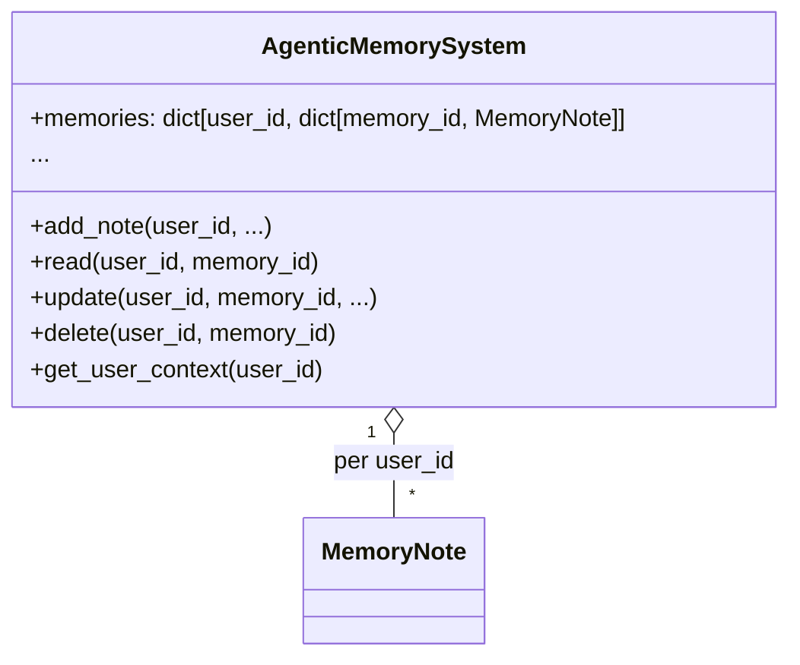

# Task 006: Agentic Memory Multi-User Support Refactor

---

## 1. Task & Context

**Task:**  
Refactor the agentic memory system to fully support multi-user memory, with strict namespacing of all memory operations by `user_id` and a check to ensure that no memory is stored unless a user is identified.

**Scope:**  
- `backend/src/a_mem/memory_system.py`
- `backend/src/memory/manager.py`
- All code that interacts with the agentic memory system

**Branch:**  
feature/agentic-memory-multiuser-support

---

## 2. Problem Statement

Currently, the agentic memory system (`AgenticMemorySystem`) stores all memory notes in a single flat dictionary, with no strict separation between users. This means all users share the same memory pool, and there is no enforced check to prevent storing memories for unidentified users. This is a privacy and correctness issue for multi-user deployments.

---

## 3. Solution Summary

**Goals:**
- Namespace all memory operations by `user_id` so each user has a separate memory pool.
- Require a valid `user_id` for all memory operations (add, read, update, delete, search, context aggregation).
- Add a check before storing any memory to ensure a user is identified; otherwise, skip storage and log a warning.
- Maintain backward compatibility by defaulting to `"default"` user_id if not provided, but log a warning.
- Migrate any existing flat memory dict to `"default"` namespace on first use.

---

## 4. Implementation Plan

### 4.1. Refactor `AgenticMemorySystem`

- Change `self.memories` from a flat dict `{memory_id: MemoryNote}` to a nested dict `{user_id: {memory_id: MemoryNote}}`.
- All memory operations (add, read, update, delete, search, context aggregation) must operate within the sub-dict for the given `user_id`.
- All public methods must accept a `user_id` parameter (default to `"default"` for backward compatibility, but log a warning if not provided).
- On first use, if `self.memories` is a flat dict, migrate all existing notes to `self.memories["default"]`.

### 4.2. Add User Identity Check Before Storing Memory

- In `AMemMemoryManager.add_memory` and any direct calls to `AgenticMemorySystem.add_note`, check that `user_id` is not None, not `"unknown"`, and not empty.
- If `user_id` is missing or invalid, skip storage and log a warning.

### 4.3. Update All Memory Operations

- Update all methods in `AgenticMemorySystem` and `AMemMemoryManager` that access or mutate memory to require/use `user_id`.
- Ensure all usages in the codebase (search for `.memories`, `add_note`, etc.) pass `user_id`.

### 4.4. Redis Cache

- No change needed; cache keys already use `user_id`.

### 4.5. Backward Compatibility

- If no `user_id` is provided, default to `"default"` and log a warning that multi-user support is enabled and `user_id` should be provided.

---

## 5. Mermaid Diagram

---

## 6. Summary Table

| Area                | Before                        | After (Multi-User)                |
|---------------------|------------------------------|------------------------------------|
| `self.memories`     | `{memory_id: note}`           | `{user_id: {memory_id: note}}`     |
| Add/Read/Update     | No user_id param              | Require user_id param              |
| Store w/o user_id   | Always stores                 | Skips storage, logs warning        |
| Context cache       | Per user_id (already)         | No change                          |
| Backward compat     | Single-user default           | "default" user_id if missing       |

---

## 7. Migration/Compatibility Notes

- On deployment, any existing flat memory dict will be migrated to the `"default"` namespace.
- All new code should pass a valid `user_id` for every memory operation.
- Logging will warn if memory is stored or accessed without a valid user_id.

---

## 8. Success Criteria

- Each user's memories are strictly separated and cannot be accessed by other users.
- No memory is stored unless a valid user_id is present.
- All memory operations (add, read, update, delete, search, context aggregation) are namespaced by user_id.
- Backward compatibility is maintained for single-user deployments.

---

## 9. Commit Message

`feat: refactor agentic memory system for strict multi-user support and user_id namespacing`

---

## 10. Status

**READY FOR IMPLEMENTATION**